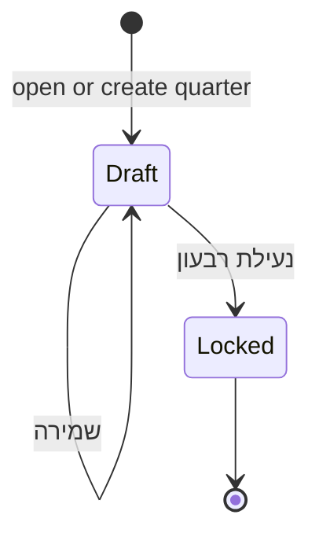

# Yahpaz (יחפ״צ) — Quarterly fuel request (דרישת דלק) — Design

**Date:** 2026-08-11  
**Repo:** `yhpz-2026`  
**Status:** Approved in brainstorming (Approach 1: workbook + `fuel_quarters` / distributions)  
**Depends on:** Fuel km rule (`event_responders.total_km`, filter by `events.created_at`); admin role gate  
**Source:** Moshe WhatsApp backlog item #6

## Problem

Once a quarter, admins issue fuel cards from accumulated volunteer km, carry leftover (or deficit) km into the next quarter, and record card numbers. Today’s **החזר דלק** only summarizes km — it cannot store opening balances, card counts, or lock a distribution period. This is a core ops ritual and must be convenient for admins (desktop-first), not a throwaway calculator.

## Goals (v1)

- Admin-only **דרישת דלק** under **ניהול** (new nav item; not visible to `shift_lead` / `responder`)
- Calendar quarter picker (year + Q1–Q4)
- One row per volunteer who matters for that quarter (see row inclusion)
- Columns: opening balance · km month1 · month2 · month3 · quarter total · liters · cards · remaining km · card numbers
- Editable **cards** (default suggested) and **card numbers**; **שמירה** persists draft
- Explicit **נעילת רבעון** freezes the quarter; next quarter opening = locked remaining
- Persist quarters + distributions in Postgres with admin-only RLS
- Hebrew-only RTL UI (רשומה)

## Non-goals (v1)

- Shift-lead or responder access
- Unlock UI (re-open locked quarter via DB only if ever needed)
- Seed / import UI for legacy balances (manual DB seed OK)
- Configurable rates (hardcode **1 liter : 6 km**, **15 liters : 1 card**)
- CSV export
- Shift km
- Money / ₪
- Mobile as primary surface (usable cards OK; optimize desktop table)

## Approach

**Quarterly workbook + two tables.**  
Live km always computed from events. Opening balance comes from the previous **locked** quarter’s remaining (else 0). Draft distribution rows store admin card count + card numbers. Lock snapshots the workbook into immutable distribution rows and sets `fuel_quarters.status = locked`.

## Constants

| Name | Value | Use |
|---|---|---|
| `KM_PER_LITER` | `6` | `liters = payable_km / 6` |
| `LITERS_PER_CARD` | `15` | `suggested_cards = floor(liters / 15)` |
| Km covered by one card | `15 × 6 = 90` | `remaining = payable_km − cards × 90` |

## Quarter definition

- Calendar quarters in local time: Q1 Jan–Mar, Q2 Apr–Jun, Q3 Jul–Sep, Q4 Oct–Dec
- UI: year selector + quarter chips/select
- Default on open: **current** calendar quarter
- Month columns = the three months of the selected quarter (Hebrew month labels)

## Kilometers

- Source: `event_responders.total_km` where not null (`0` counts)
- Bucket by parent `events.created_at` local calendar month (same product rule as החזר דלק)
- No filter on event/participation status or cancelled
- Shifts excluded

## Opening balance

| Case | Opening |
|---|---|
| Previous calendar quarter exists and is **locked** | That volunteer’s locked `remaining_km` |
| No previous locked quarter / volunteer absent there | `0` |
| Legacy migration | Manual insert/update in DB (no v1 UI) |

Opening is **read-only** in the UI (except via DB seed).

## Row inclusion

Show a volunteer if **any** of:

1. `opening_balance ≠ 0`
2. Sum of the three month km columns ≠ 0
3. A distribution row already exists for this quarter (draft or locked) for that user

Sort: `full_name` ascending (he). Inactive users appear only via (1) or (3) if they still have balance/history — prefer including them when opening ≠ 0 or distribution exists so leftovers are not orphaned. Active users with only km are included via (2).

Clarified rule: include if opening ≠ 0 OR quarter km ≠ 0 OR distribution exists (active or inactive).

## Math (per row)

```
payable_km     = opening_balance + km_m1 + km_m2 + km_m3
liters         = payable_km / 6          // display; may be fractional
suggested_cards = floor(liters / 15)     // floor toward −∞ for negative payable? see below
cards          = admin value (default suggested_cards when no saved row)
remaining_km   = payable_km − cards × 15 × 6
```

**Negative payable:** allowed (carried deficit). `suggested_cards = max(0, floor(liters / 15))` when liters &lt; 0 — do not suggest negative cards. Admin may still set cards to 0.

**Cards field:** integer ≥ 0; prefilled with suggested until admin edits or a saved value exists. UI always shows **מומלץ: N** (click applies).

**Card numbers:** Enter-to-add list (newline-separated in DB). Counter `entered/cards`. Save/lock blocked unless `entered === cards` for every row. Reducing cards trims excess numbers.

## Lifecycle



- **Draft:** km columns stay live (recomputed on load); saved cards / card_numbers / opening_snapshot editable fields persist
- **Lock:** confirm dialog; write final `opening_balance`, month km, totals, liters, cards, remaining, card_numbers onto distribution rows; set quarter `locked_at`; no further edits
- **Next quarter:** opening pulled only from **locked** previous remaining
- **Unlock:** out of v1

On first visit to a draft quarter with no `fuel_quarters` row: create draft quarter lazily (admin insert).

## Schema

### `fuel_quarters`

| Column | Type | Notes |
|---|---|---|
| `id` | uuid PK | |
| `year` | int | e.g. 2026 |
| `quarter` | int | 1–4 |
| `status` | text | `draft` \| `locked` |
| `locked_at` | timestamptz null | |
| `locked_by` | uuid null → profiles | |
| `created_at` / `updated_at` | timestamptz | |

Unique `(year, quarter)`.

### `fuel_quarter_distributions`

| Column | Type | Notes |
|---|---|---|
| `id` | uuid PK | |
| `quarter_id` | uuid FK | |
| `responder_id` | uuid FK profiles | |
| `opening_balance_km` | numeric | Snapshot used for this row (at save/lock) |
| `km_month_1` / `_2` / `_3` | numeric | Snapshot on **lock**; draft may omit or refresh on save |
| `quarter_km` | numeric | Sum of months (stored on lock; draft can recompute) |
| `cards` | int | Admin-chosen |
| `card_numbers` | text | Free text |
| `remaining_km` | numeric | Stored on save/lock from formula |
| `created_at` / `updated_at` | timestamptz | |

Unique `(quarter_id, responder_id)`.

**Draft save behavior:** persist `cards`, `card_numbers`, and current `opening_balance_km` / month km / remaining so reload restores edits; km snapshots refresh from live events on each draft load **except** cards/card_numbers (and any admin-overridden cards stay). Opening still from prior lock.

**Lock behavior:** freeze all numeric snapshots + cards + card_numbers; status locked.

### RLS

- SELECT / INSERT / UPDATE / DELETE: **admin only** (reuse existing admin helper)
- No access for shift_lead / responder

## UI

| Element | Hebrew |
|---|---|
| Nav + title | דרישת דלק |
| Helper | חלוקת כרטיסי דלק לפי רבעון — יתרות עוברות לרבעון הבא |
| Year | שנה |
| Quarter | רבעון · Q1… or א׳–ד׳ with month range caption |
| Save | שמירה |
| Lock | נעילת רבעון |
| Lock confirm | לנעול את הרבעון? לא ניתן לערוך לאחר הנעילה. היתרות יעברו לרבעון הבא. |
| Locked badge | נעול |
| Empty | אין כוננים עם ק״מ או יתרה ברבעון זה. |
| Load error | לא הצלחנו לטעון את דרישת הדלק. |

**Columns (logical order):** כונן · יתרה מרבעון קודם · &lt;חודש1&gt; · &lt;חודש2&gt; · &lt;חודש3&gt; · סה״כ ק״מ · ליטרים · כרטיסים · יתרה (ק״מ) · מספרי כרטיסים

- Desktop: wide table; sticky first column (כונן); numeric mono; editable cells for כרטיסים + מספרי כרטיסים only when draft
- Mobile: one card per volunteer; show payable + remaining prominently; editors for cards / numbers
- Liters display: one decimal OK
- Dirty state: enable שמירה when local edits differ from loaded

## Architecture (app)

| Piece | Role |
|---|---|
| Migration | tables + RLS |
| `src/lib/fuelQuarterMath.ts` | pure constants + formulas + suggested cards (unit-tested) |
| `src/lib/fuelQuarterReport.ts` | load quarter, aggregate monthly km, merge opening + distributions, save, lock |
| `src/pages/FuelQuarterPage.tsx` | workbook UI |
| App shell | `AppView` e.g. `fuel_quarter`; admin nav + mobile admin segment |
| `design-system-design-instructions/screens/admin.md` | document screen |

## Permissions

- UI + RLS: `admin` only
- Shift-lead must not see nav entry

## Testing

- Unit: liters, floor cards, remaining (incl. 0 cards, override cards, negative opening)
- Unit: month bucketing by local `created_at`
- Unit: row inclusion rules
- Manual: admin opens/saves/locks; shift-lead has no nav; next quarter opening matches locked remaining

## Error handling

- Load/save/lock failure → toast or inline error + retry
- Lock with unsaved edits → save then lock, or block with “שמרו לפני נעילה”

## Open follow-ups (later)

- Unlock with audit
- CSV export
- Bulk seed UI
- Configurable KM_PER_LITER / LITERS_PER_CARD
- Link from row to פירוט דלק filtered to that volunteer/quarter
